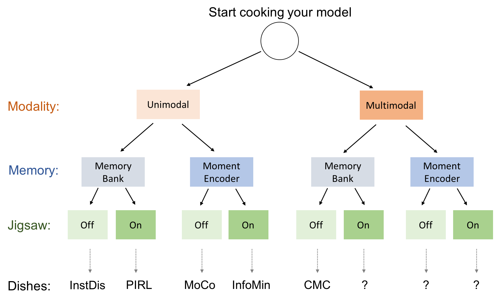

## PyContrast
Modified for use on single-channel x-ray images. All training is done using distributed data parallel for efficiency, which requires NVIDIA NCCL to be loaded. With DDP, you may also train on multiple nodes at once. Modifications for training with x-ray images are based around the MOCOv2 method.

To train the contrastive learning task in a local Linux environment (such as lambda-stack) using mixed precision (specified by --amp and --opt\_level):

	nohup python -u main_contrast.py --method MoCov2 --multiprocessing-distributed --world-size 1 --rank 0 --data_folder=../../data/512_dataset.h5 --num_workers=8 --batch_size=192 --channels=1 --amp --opt_level O1 --epochs 200 > output.log &

To fine-tune on the target task (WITH contrastive loss still enforced) in a local Linux environment (such as lambda-stack):

	nohup python main_xray.py --method MoCov2 --aug_linear custom --data_folder ../../data/256_pathology_fixed_dataset.h5 --multiprocessing-distributed --world-size 1 --rank 0 --loss bce --channels 1 --n_class 14 --batch_size 768 --epochs 40 --finetune True > linear.log &

If you wish to fine-tune on just the target task, we recommend first training the contrastive learning model, and then using saved weights, along with the SimCLR scripts in the parent directory, for fine-tuning.

Below documentation is for the general contrastive learning framework developed in Phillip Isola's Group at MIT.

### Introduction
Recently, contrastive learning approaches have significantly advanced the SoTA of 
unsupervised (visual) representation learning. This repo contains pytorch 
implementation of a set of (improved) SoTA methods using the same training and 
evaluation pipeline. 

It supports multi-node distributed training (e.g., 32 GPUs across 4 machines) and 
the mixed precision feature.

### Contents
**(1) For now, it covers the following methods as well as their combinations 
(the order follows the forward arrow of time):**

- (InstDis) Unsupervised Feature Learning via Non-parameteric Instance Discrimination
  [[pdf]](https://arxiv.org/pdf/1805.01978.pdf) 
  
- (CMC) Contrastive Multiview Coding.
  [[pdf]](https://arxiv.org/abs/1906.05849) 
  [[project page]](https://hobbitlong.github.io/CMC/)

- (MoCo) Momentum Contrast for Unsupervised Visual Representation Learning
  [[pdf]](https://arxiv.org/pdf/1911.05722.pdf)

- (PIRL) Self-Supervised Learning of Pretext-Invariant Representations
  [[pdf]](https://arxiv.org/abs/1912.01991)

- (MoCo v2) Improved Baselines with Momentum Contrastive Learning
  [[pdf]](https://arxiv.org/pdf/2003.04297.pdf)

- (InfoMin) What Makes for Good Views for Contrastive Learning?
  [[pdf]](https://arxiv.org/pdf/2005.10243.pdf)
  [[project page]](https://hobbitlong.github.io/InfoMin/)

**(2) The following figure illustrates the similarity and dissimilarity between these methods, 
in terms of training pipeline. Question mark `?` means unreported methods which are also supported.**

  

**(3) TODO:**
- (SimCLR) A Simple Framework for Contrastive Learning of Visual Representations
  [[pdf]](https://arxiv.org/pdf/1805.01978.pdf) [[Prototype Implementation]](https://github.com/HobbitLong/SupContrast)

- (SupCon) Supervised Contrastive Learning
  [[pdf]](https://arxiv.org/abs/2004.11362) [[Prototype Implementation]](https://github.com/HobbitLong/SupContrast)

### Results on ImageNet linear readout benchmark
(1) Results with ResNet-50:
|          |Arch | # Parameters | Epochs | Accuracy(%) |
|----------|:----:|:---:|:---:|:---:|
|  InstDis         | ResNet-50 | 24M   | 200 |  59.5  |
|  CMC (no RA)     | ResNet-50*| 12M   | 200 |  58.6  |
|  MoCo            | ResNet-50 | 24M   | 200 |  60.8  | 
|  PIRL            | ResNet-50 | 24M   | 200 |  61.7  |
|  MoCo v2         | ResNet-50 | 24M   | 200 |  67.5  |
|  InfoMin         | ResNet-50 | 24M   | 100 |  67.4  |
|  InfoMin         | ResNet-50 | 24M   | 200 |  70.1  |
|  InfoMin         | ResNet-50 | 24M   | 800 |  73.0  |

(2) InfoMin with other architectures:
|          |Arch | # Parameters | Epochs | Accuracy(%) |
|----------|:----:|:---:|:---:|:---:|
|  InfoMin         | ResNet-101  | 43M   | 300 |  73.4  |
|  InfoMin         | ResNet-152  | 58M   | 200 |  73.4  |
|  InfoMin         | ResNeXt-101 | 87M   | 200 |  74.5  | 
|  InfoMin         | ResNeXt-152 | 120M  | 200 |  75.2  |

### Install Environments
Please see [INSTALL.md](docs/INSTALL.md).

### Running
For training and testing different models, please see [RUN.md](docs/RUN.md).

### Model Zoo
For pre-trained models and results, please check [MODEL_ZOO.md](docs/MODEL_ZOO.md).

### Object Detection
Please check [detection](detection).

 
